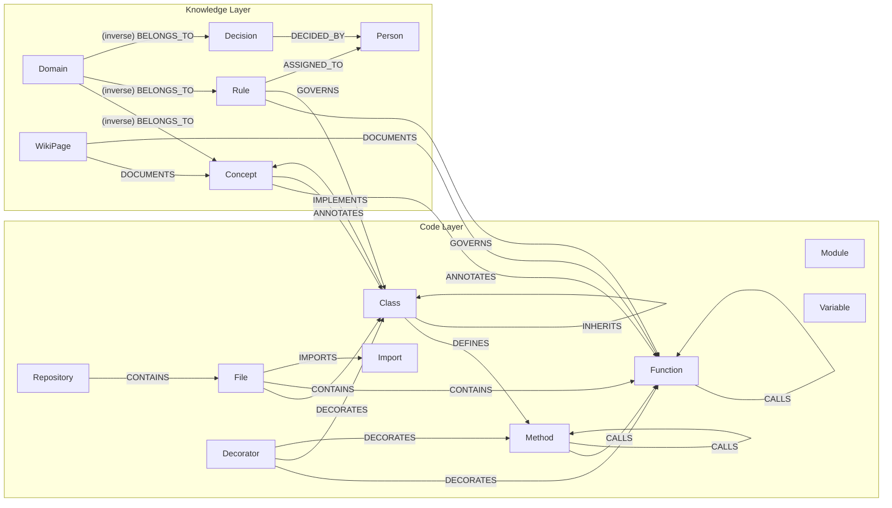

# Graph Schema

## Node labels

### Code layer

| Label | Properties | Description |
|---|---|---|
| `Repository` | `name`, `path`, `url`, `ingested_at` | Top-level repo node |
| `File` | `path`, `language`, `lines`, `size` | Source file |
| `Module` | `name`, `file`, `path` | Python module or TS namespace |
| `Class` | `name`, `file`, `line`, `end_line`, `docstring`, `is_abstract` | Class definition |
| `Function` | `name`, `file`, `line`, `end_line`, `signature`, `docstring`, `is_async` | Top-level function |
| `Method` | `name`, `file`, `line`, `end_line`, `signature`, `docstring`, `is_async`, `is_classmethod`, `is_staticmethod` | Class method |
| `Variable` | `name`, `file`, `line`, `type_annotation` | Module-level variable |
| `Import` | `name`, `alias`, `file`, `line`, `from_module` | Import statement |
| `Decorator` | `name`, `expression`, `file`, `line` | Decorator applied to function/class |

### Knowledge layer

| Label | Properties | Description |
|---|---|---|
| `Domain` | `name`, `description`, `created_at` | Top-level grouping for concepts, rules, decisions |
| `Concept` | `name`, `description`, `domain`, `status`, `created_at` | Named domain concept or design pattern |
| `Rule` | `name`, `description`, `domain`, `severity`, `rationale`, `created_at` | Enforceable constraint; severity: `info`, `warning`, `critical` |
| `Decision` | `name`, `description`, `domain`, `rationale`, `alternatives`, `date`, `status`, `created_at` | Architectural decision record; status: `proposed`, `accepted`, `deprecated`, `superseded` |
| `WikiPage` | `title`, `content`, `url`, `source`, `updated_at` | Wiki page or document |
| `Person` | `name`, `email`, `role`, `team`, `created_at` | Team member or contributor |

---

## Edge types

| Edge | From | To | Meaning |
|---|---|---|---|
| `CONTAINS` | Repository, File, Module, Class | File, Class, Function, Method, Variable, Import | Structural containment |
| `DEFINES` | File, Class | Class, Function, Method | Definition site |
| `IMPORTS` | File | Import | File imports a module or symbol |
| `DEPENDS_ON` | File, Module | File, Module | Module-level dependency |
| `CALLS` | Function, Method | Function, Method | Direct function call (static analysis) |
| `REFERENCES` | Function, Method, File | Variable, Class, Function | Name reference (not a call) |
| `INHERITS` | Class | Class | Class inherits from parent |
| `IMPLEMENTS` | Class, Function | Concept | Code implements a concept or interface |
| `DECORATES` | Decorator | Function, Method, Class | Decorator applied to target |
| `BELONGS_TO` | Concept, Rule, Decision, Person | Domain | Membership in a domain |
| `RELATED_TO` | Any | Any | General semantic relationship |
| `GOVERNS` | Rule | Function, Method, Class, File | Rule applies to code node |
| `DOCUMENTS` | WikiPage | Concept, Function, Class, File | Documentation relationship |
| `ANNOTATES` | Concept, Rule | Function, Method, Class, File, Module | Knowledge node annotates code node |
| `ASSIGNED_TO` | Rule, Decision | Person | Work item or decision assigned to person |
| `DECIDED_BY` | Decision | Person | Decision was made by person |

---

## Schema diagram

---

## Code vs knowledge layer distinction

The two layers have different **lifecycle** and **provenance**:

| Dimension | Code layer | Knowledge layer |
|---|---|---|
| Source | tree-sitter AST parsing | Manual curation, wiki, Planopticon |
| Refresh | On every `navegador ingest` | On demand (`navegador add`, `wiki ingest`, `planopticon ingest`) |
| Change rate | Fast (changes with every commit) | Slow (changes with design decisions) |
| Authorship | Derived from code | Human or meeting-authored |
| Queryability | Names, signatures, call graphs | Domain semantics, rationale, history |

Cross-layer edges (`ANNOTATES`, `GOVERNS`, `IMPLEMENTS`, `DOCUMENTS`) are the join points between the two layers. They are created explicitly by humans via `navegador annotate` or inferred during wiki/Planopticon ingestion.
